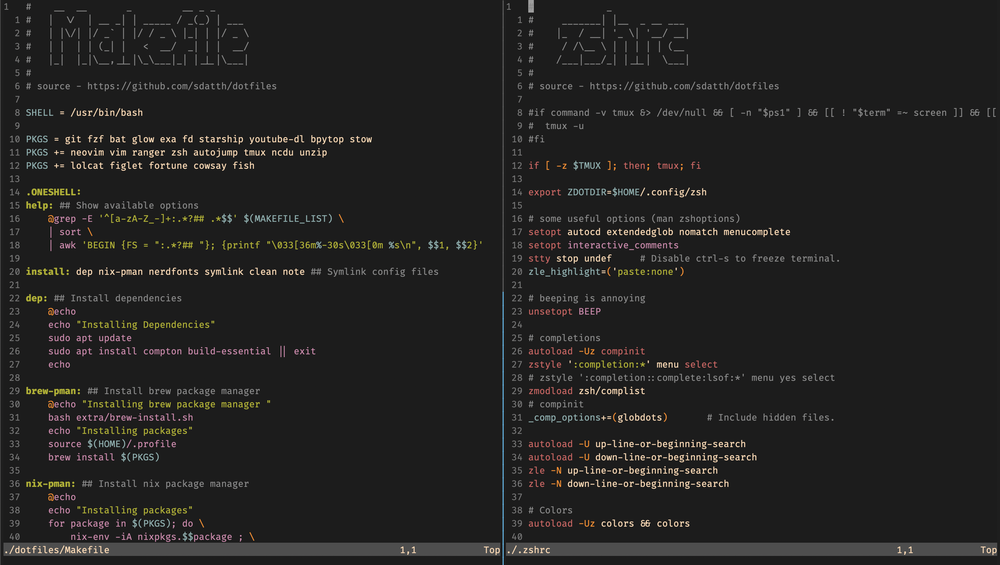

# dotfiles



#### Note
- This is a script to get all my configurations, it will either install nix or brew package manager according to your choice.
- Only nix is supported for arm64.
- We have a separate branch for mac install. Please check that out for macOS.

## One line Installation

```bash
bash <(curl -fsSL https://raw.githubusercontent.com/sdatth/dotfiles/refs/heads/main/script.sh)
```

## Manual Installation

!!! You will need `make` package

Clone into your `$HOME` directory or `~`

```bash
git clone https://github.com/sdatth/dotfiles.git
# OR
git clone https://gitlab.com/sdatth/dotfiles.git
```

### Choose your package manager

(Note : Arm64 only has compatibility with nix)

```bash
make [brew|nix]
```

### For Linux Distros

Run the command to install necessary packages and get my config files for your linux distribution
```bash
make [arch|debian|ubuntu|rhel]
```

### For FreeBSD

You will need `gmake`

Run the command to install necessary packages and get my config files for FreeBSD
```bash
gmake freebsd
```

### Help

Use the help recipe to see available options
```bash
make help
```


#### Note Important:

This script will install files from
- zsh-autosuggestions plugin          : https://github.com/zsh-users/zsh-autosuggestions
- zsh-syntax-highlighting plugin      : https://github.com/zsh-users/zsh-syntax-highlighting
- zsh-history-substring-search plugin : https://github.com/zsh-users/zsh-history-substring-search

This repo contains code/files from other repo, they are the original authors for this
- Vim Plug        : https://github.com/junegunn/vim-plug
- Nerd Fonts      : https://www.nerdfonts.com/
- Autojump plugin : https://github.com/wting/autojump
