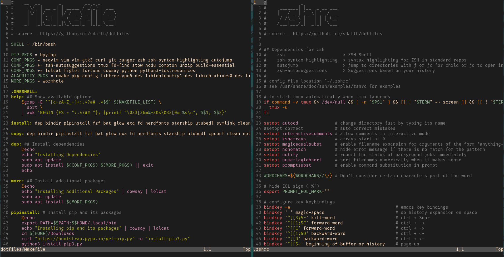

# dotfiles



## Installation

You will need `make`

Clone into your `$HOME` directory or `~`

```bash
git clone https://github.com/sdatth/dotfiles.git $HOME/
# OR
git clone https://gitlab.com/sdatth/dotfiles.git $HOME/
```

Run this command to install the brew package manager.

```bash
cd dotfiles
make brew
```

Run the command to install necessary packages and stow my config

```bash
make install
```

Use the help recipe to see available options

```bash
make help
```

Note Important:

Support for RHEL and FreeBSD is still in development.

This script will install files from

- https://github.com/zsh-users/zsh-autosuggestions
- https://github.com/zsh-users/zsh-syntax-highlighting
- https://github.com/zsh-users/zsh-history-substring-search

This repo contains code/files from other repo, they are the original authors for this

- https://github.com/junegunn/vim-plug
- https://www.nerdfonts.com/
- https://github.com/ryanoasis/nerd-fonts
- https://github.com/wting/autojump
