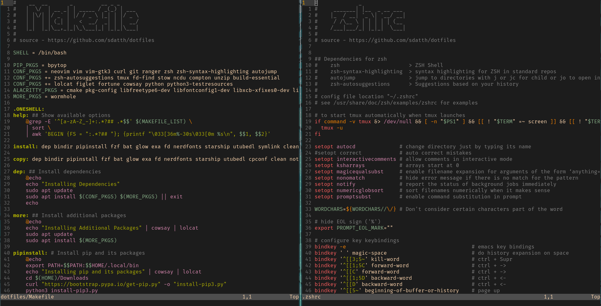

# dotfiles



!! Warning, this only works on ubuntu/debain distributions. It has been tested on ubuntu 20.04 only! <br> 
!! Other people can copy my config files or symlink it using the `stow` command.

## Installing

You will need `make` & `build-essential` 

Clone into your `$HOME` directory or `~`

```bash
git clone https://github.com/sdatth/dotfiles.git ~/
# OR
git clone https://gitlab.com/sdatth/dotfiles.git ~/
```

Run the make command to get my configuration
```bash
cd dotfiles
make
```

Compile alacritty from scratch
```bash
# this just follows all the steps from the official repo "https://github.com/alacritty/alacritty"
make alacritty
```

Symlink my config files
```bash
make stow
```

Copy the config files without symlinks
```bash
make cpconf
```
